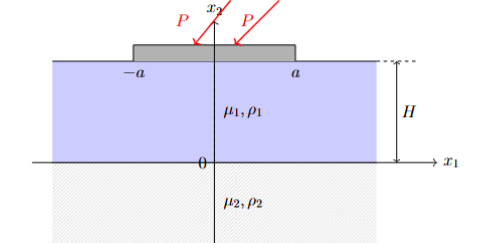
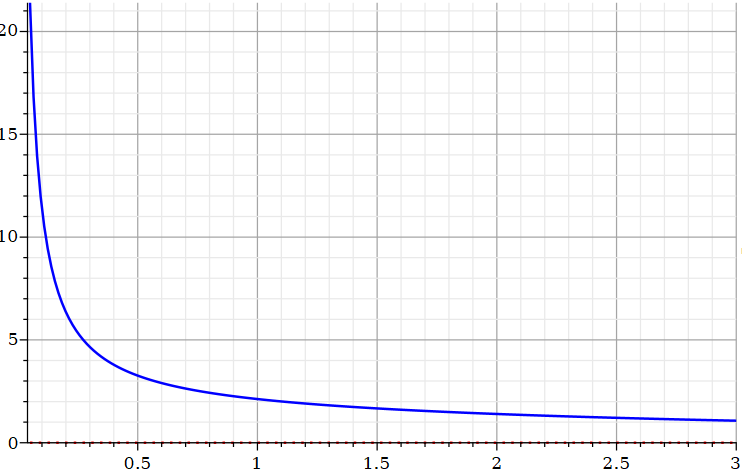
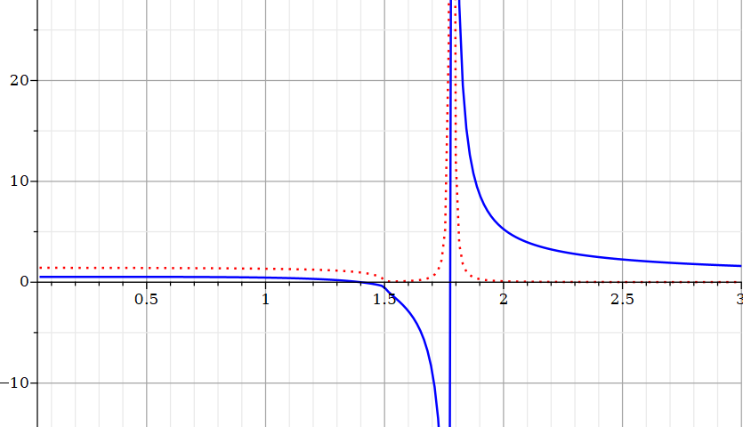
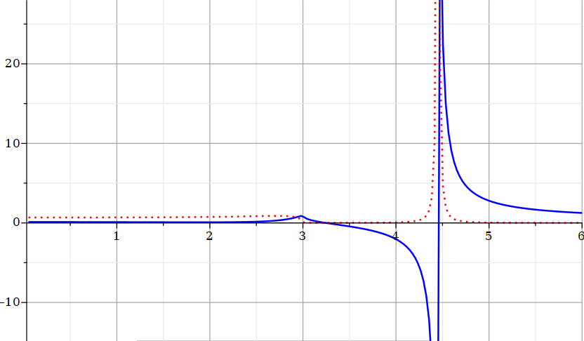
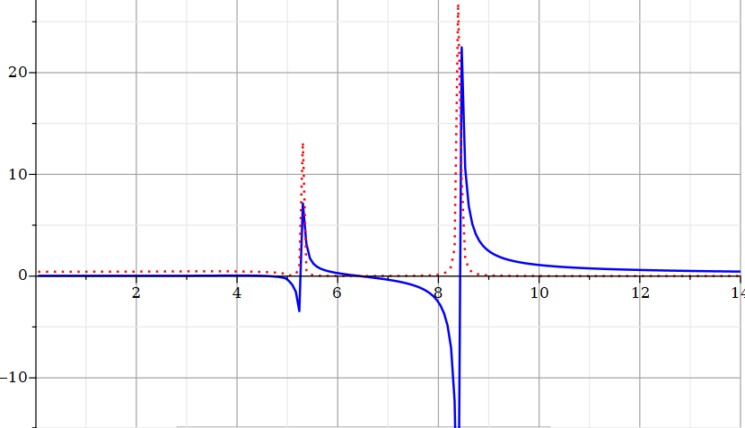

# VKR_contact_problem
## Этапы работы

### 1. Постановка вспомогательной задачи

Формулируется задача о вынужденных антиплоских колебаниях однородного упругого
слоя, лежащего на полупространстве. Применяется преобразование Фурье по
координате $x_1$; краевая задача сводится к обыкновенному дифференциальному
уравнению по глубине $x_2$ с граничными условиями на поверхности, на стыке
слой–полупространство и условием излучения при $x_2 \to -\infty$.

**Промежуточный результат:** символ (трансформанта) поверхностной функции
влияния $\tilde K(\alpha)$, связывающий поверхностное смещение и нагрузку.

*Рис. 1. Геометрия задачи: слой на полупространстве, штамп шириной 2a.*

### 2. Обобщение на функционально-градиентный слой

Постановка распространяется на слой с переменными по глубине $\mu(x_2)$ и
$\rho(x_2)$. Уравнение записывается в виде системы ОДУ первого рода относительно
пары «смещение–напряжение» $(U, \Sigma)$, пригодной для численного
интегрирования при произвольном профиле.

**Промежуточный результат:** система Коши для $(U, \Sigma)$; профиль
«мягкий верх» $\mu(x_2) = 1 - 0.8\,x_2$ ($\mu$ от 1 у основания до 0.2 у
поверхности).

*Рис. 2. Профиль модуля сдвига μ(x₂) для рассмотренных моделей.*

### 3. Функция влияния и ядро

Задача Коши решается методом Рунге–Кутты 4-го порядка (в комплексной
арифметике), после чего собирается символ
$\tilde K(\alpha) = (U_1 + \gamma_2 U_2)/(\Sigma_1 + \gamma_2 \Sigma_2)$,
где $\gamma_2 = \sqrt{\alpha^2 - \kappa^2}$ — радикал полупространства.

**Промежуточный результат:** для однородного слоя численное решение (RK4)
совпадает с аналитическим символом с точностью $\sim 10^{-11}$ — верификация
метода. Асимптотика $\tilde K(\alpha) \sim 1/(\mu(1)\,\alpha)$ при
$\alpha \to \infty$ подтверждает логарифмическую особенность ядра в нуле.

| $\kappa = 0$ | $\kappa = 1.5$ | $\kappa = 3.0$ | $\kappa = 5.0$ |
| :---: | :---: | :---: | :---: |
|  |  |  |  |

*Рис. 3. Символ K̃(α) для однородного и ФГМ-слоёв; сравнение RK4 с аналитикой.*

### 4. Дисперсионный анализ

Ищутся корни $\alpha_n(\kappa)$ дисперсионного уравнения
$D(\alpha, \kappa) = \Sigma_1 + \gamma_2 \Sigma_2 = 0$ — полюса ядра, то есть
распространяющиеся моды Лява. Все корни лежат в полосе захвата
$\kappa < \alpha < \kappa/\sqrt{\mu_{\min}} \approx 2.24\,\kappa$.

**Промежуточный результат:** фундаментальная мода распространяется при всех
частотах; высшие моды включаются на частотах отсечки
$\kappa_2 \approx 3.80$, $\kappa_3 \approx 7.36$, $\kappa_4 \approx 10.92$
(шаг $\approx 3.56$). При отсечке мода рождается на линии $\alpha = \kappa$.

.png)
*Рис. 4. Дисперсионные кривые αₙ(κ); отмечены отсечки κ₂, κ₃ и линия α=κ.*

### 5. Интегральное уравнение и контур интегрирования

Контактная задача сводится к интегральному уравнению первого рода со
слабосингулярным (логарифмическим) ядром. Ядро $J(u)$ (первообразная функции
влияния) вычисляется контурным интегрированием: контур $\sigma$ опускается под
вещественную ось, обходя снизу точку ветвления $\alpha = \kappa$ и полюса
$\alpha_n$ (предельное поглощение $\kappa \to \kappa(1 + i\varepsilon)$), и далее
идёт по вещественной оси до бесконечности.

**Промежуточный результат:** гладкое (без полюсов и корневых изломов) ядро
$J(u)$, пригодное для сборки СЛАУ; корневая особенность контактного напряжения
на краях $\tau \sim (a^2 - \xi^2)^{-1/2}$.

*Рис. 5. Контур σ в плоскости α: обход точки ветвления ±κ и полюсов ±αₙ.*

### 6. Метод граничных элементов и сходимость

На равномерной сетке собирается СЛАУ с тёплицевой матрицей. Решается
нормированная задача $\tau_0$ (единичная правая часть), затем из уравнения
движения штампа находится смещение
$\delta = T / (\int \tau_0\,d\xi - m\kappa^2)$, и физическое напряжение
$\tau = \delta\,\tau_0$.

**Промежуточный результат:** решение сходится по числу элементов $N$; центр
контакта сходится быстро (гладкая точка), край — медленнее (особенность), но при
$N = 60$ относительное изменение $< 1\%$. Достаточность сетки $N = 20$ при
$a = 0.5$ ($h = 0.05$) подтверждена.

*Рис. 6. Сходимость контактного напряжения при N = 20, 40, 60.*

### 7. Результаты: контактные напряжения и АЧХ

Строятся распределения контактного напряжения при разных частотах и
амплитудно-частотная характеристика штампа $\delta(\kappa)$.

**Контактные напряжения.** С ростом частоты нагрузка перераспределяется от краёв
к центру: при $\kappa = 1.5$ она прижата к краям (квазистатика, край $\approx$
вдвое выше центра), при $\kappa = 3.0$ выравнивается, при $\kappa = 5.0$ центр
превышает край, при $\kappa = 8.0$ распределение осциллирующее и центрированное.
Смена «край → центр» происходит около отсечки $\kappa_2 \approx 3.8$; на высоких
частотах (длина волны меньше штампа) вещественная часть напряжения меняет знак
поперёк контакта.

*Рис. 7. Распределение |τ(ξ)| под штампом при κ = 1.5, 3.0, 5.0, 8.0.*

**Амплитудно-частотная характеристика** (для $a = 0.5$, $m = 0.1$). На низких
частотах — пологое плато податливости со слабым передемпфированным резонансом
(максимум $\mathrm{Im}\,\delta$ при $\kappa \approx 1.44$, смена знака
$\mathrm{Re}\,\delta$ при $\kappa \approx 1.88$); далее монотонный спад ($\sim$13×).
Резонанс передемпфирован, так как фундаментальная мода Лява уносит энергию при
любой частоте; острых пиков нет. Частоты отсечки в модуле АЧХ заметного излома
не дают.

*Рис. 8. АЧХ δ(κ): вещественная и мнимая части и модуль |δ|.*
